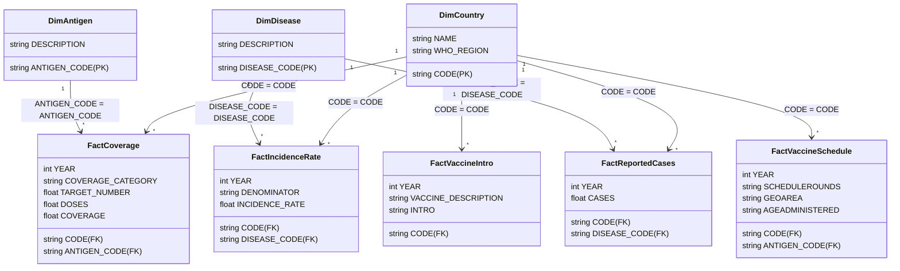

# Power BI Implementation Guide: Vaccination Data Analytics & Visualization

This guide provides the complete blueprint for loading the normalized vaccination database into **Power BI**, building the star-schema data model, creating required DAX calculations, and building the interactive public health dashboards.

---

## 1. Data Connection & Architecture

Power BI can connect directly to the cleaned UTF-8 CSV files in `cleaned_data/` or via ODBC/SQLite connector to `vaccination.db`.

### Source Files to Load into Power BI:
1. **`dim_country.csv`** (Country dimension: `CODE`, `NAME`, `WHO_REGION`)
2. **`dim_antigen.csv`** (Antigen dimension: `ANTIGEN_CODE`, `DESCRIPTION`)
3. **`dim_disease.csv`** (Disease dimension: `DISEASE_CODE`, `DESCRIPTION`)
4. **`fact_coverage.csv`** (Immunization coverage: `CODE`, `YEAR`, `ANTIGEN_CODE`, `COVERAGE_CATEGORY`, `TARGET_NUMBER`, `DOSES`, `COVERAGE`)
5. **`fact_incidence_rate.csv`** (Disease incidence: `CODE`, `YEAR`, `DISEASE_CODE`, `DENOMINATOR`, `INCIDENCE_RATE`)
6. **`fact_reported_cases.csv`** (Disease cases: `CODE`, `YEAR`, `DISEASE_CODE`, `CASES`)
7. **`fact_vaccine_intro.csv`** (Introduction timeline: `CODE`, `YEAR`, `VACCINE_DESCRIPTION`, `INTRO`)
8. **`fact_vaccine_schedule.csv`** (Dosing schedules: `CODE`, `YEAR`, `ANTIGEN_CODE`, `SCHEDULEROUNDS`, `TARGETPOP`, `GEOAREA`, `AGEADMINISTERED`)

---

## 2. Power BI Data Model (Star Schema)

Configure **1-to-Many (1:*)** single-directional relationships in the Power BI Model View:



---

## 3. Essential DAX Measures

Create a dedicated measures table `_Measures` in Power BI with the following DAX calculations:

### 1. Average Coverage % (Official / WUENIC)
```dax
Avg_Coverage_Pct = 
CALCULATE(
    AVERAGE(fact_coverage[COVERAGE]),
    fact_coverage[COVERAGE_CATEGORY] = "WUENIC"
)
```

### 2. Total Target Population
```dax
Total_Target_Population = 
CALCULATE(
    SUM(fact_coverage[TARGET_NUMBER]),
    fact_coverage[COVERAGE_CATEGORY] = "ADMIN"
)
```

### 3. Total Doses Administered
```dax
Total_Doses_Administered = 
CALCULATE(
    SUM(fact_coverage[DOSES]),
    fact_coverage[COVERAGE_CATEGORY] = "ADMIN"
)
```

### 4. Unimmunized / Zero-Dose Children
```dax
Unimmunized_Children = 
CALCULATE(
    SUMX(
        fact_coverage,
        fact_coverage[TARGET_NUMBER] * (1 - (fact_coverage[COVERAGE] / 100))
    ),
    fact_coverage[COVERAGE_CATEGORY] = "ADMIN",
    fact_coverage[ANTIGEN_CODE] = "DTPCV1"
)
```

### 5. DTP Drop-Off Rate (DTP1 to DTP3 Dropout)
```dax
DTP1_Coverage = 
CALCULATE(
    AVERAGE(fact_coverage[COVERAGE]),
    fact_coverage[ANTIGEN_CODE] = "DTPCV1",
    fact_coverage[COVERAGE_CATEGORY] = "WUENIC"
)

DTP3_Coverage = 
CALCULATE(
    AVERAGE(fact_coverage[COVERAGE]),
    fact_coverage[ANTIGEN_CODE] = "DTPCV3",
    fact_coverage[COVERAGE_CATEGORY] = "WUENIC"
)

DTP_Dropout_Rate_Pct = 
DIVIDE([DTP1_Coverage] - [DTP3_Coverage], [DTP1_Coverage], 0) * 100
```

### 6. WHO 95% Coverage Target Status
```dax
Target_95_Achievement_Status = 
IF(
    [Avg_Coverage_Pct] >= 95, 
    "Target Achieved (>=95%)", 
    "Below Target (<95%)"
)
```

### 7. Total Reported Disease Cases
```dax
Total_Reported_Cases = 
SUM(fact_reported_cases[CASES])
```

### 8. Year-over-Year (YoY) Case Reduction %
```dax
YoY_Case_Reduction_Pct = 
VAR PreviousYearCases = 
    CALCULATE(
        [Total_Reported_Cases], 
        SAMEPERIODLASTYEAR(fact_reported_cases[YEAR])
    )
RETURN
    DIVIDE(PreviousYearCases - [Total_Reported_Cases], PreviousYearCases, 0) * 100
```

---

## 4. Dashboard Design & Visualizations

Build the 4 core interactive dashboard pages:

### Page 1: Executive Global Immunization Overview
- **KPI Cards across Top**:
  - Global Average Coverage % (with color KPI conditional formatting: Green >= 90%, Yellow 80-89%, Red < 80%)
  - Total Unimmunized Cohort Count
  - Total Reported Disease Cases
  - Average DTP Dropout Rate %
- **World Map / Filled Map**:
  - Location: `dim_country[NAME]`
  - Tooltips: `Avg_Coverage_Pct`, `Total_Reported_Cases`, `WHO_REGION`
  - Color saturation: `Avg_Coverage_Pct` (Red to Green gradient)
- **Multi-Year Trend Chart (Line Chart)**:
  - X-Axis: `YEAR`
  - Y-Axis: `Avg_Coverage_Pct`
  - Legend: Key Antigens (`BCG`, `DTPCV3`, `MCV1`, `POL3`, `HEPB3`)
- **Global Slicers**: `WHO_REGION`, `YEAR` (slider), `ANTIGEN_CODE`.

### Page 2: Drop-Off & Adherence Analysis
- **Gauge Visual**: MCV1 vs MCV2 retention rate.
- **Bar Chart**: Top 15 Countries with Highest DTP1 to DTP3 Dropout Rate.
- **Scatter Plot (Coverage vs Disease Incidence)**:
  - X-Axis: `Coverage %`
  - Y-Axis: `Incidence Rate`
  - Bubble Size: `Total Target Population`
  - Play Axis / Slider: `YEAR`
- **Schedule Breakdown Table**: Dose count, `GEOAREA` (National vs Sub-national), and Target population description.

### Page 3: Disease Impact & Vaccine Introduction
- **Before vs After Introduction Analysis**:
  - Clustered Column Chart: Average reported cases 3 years prior to introduction vs 3 years after introduction for Measles, Polio, and Rubella.
- **Regional Disparity Matrix**:
  - Rows: `WHO_REGION`
  - Columns: Key Vaccines (`HPV`, `Rotavirus`, `Pneumococcal`)
  - Values: % of countries that have introduced the vaccine (`INTRO = 'Yes'`).

### Page 4: Resource Allocation & Priority Action Matrix
- **Decomposition Tree**:
  - Root: Total Unimmunized Target Population.
  - Branches: `WHO_REGION` $\rightarrow$ `dim_country[NAME]` $\rightarrow$ `Antigen`.
- **Target Tracking Table**:
  - Country, WHO Region, MCV1 Coverage %, DTP3 Coverage %, Gap to 95% Target.
  - Conditional formatting: Flag countries lagging more than 15% below the WHO 2030 target.
