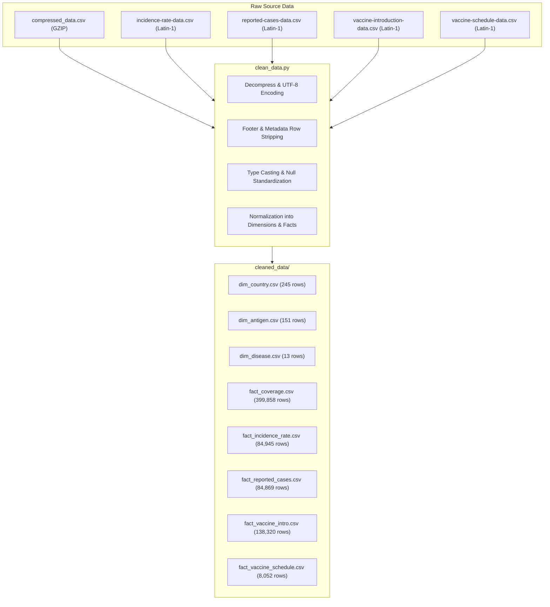

# Global Vaccination Data Analytics, Epidemiology & Machine Learning Capstone Report

**Project Title**: Vaccination Data Analysis, Relational Database Modeling, and Predictive Analytics  
**Domain**: Public Health, Epidemiology, and Healthcare Operations  
**Frameworks & Tools**: Python (Pandas, NumPy, Scikit-Learn, SciPy, Matplotlib, Seaborn), SQL (SQLite `vaccination.db` & MS SQL Server `VaccinationDB`), Power BI (`vaccination.pbix`), Jupyter Notebooks (`vaccination eda.ipynb` & `vaccination ml.ipynb`)

---

## 1. Executive Summary & Problem Formulation

Immunization is universally acknowledged as one of modern medicine's most cost-effective public health interventions, saving an estimated 3.5 to 5 million lives annually from diseases such as measles, polio, diphtheria, pertussis, tetanus, hepatitis B, and tuberculosis. However, severe disparities in vaccine coverage persist globally, exacerbated by geopolitical disruption, supply chain breakdowns, and socio-geographic barriers.

This project delivers an end-to-end data engineering, statistical surveillance, and predictive analytics framework analyzing **over 700,000 historical surveillance records** (1980–2023) across 245 countries and all 6 World Health Organization (WHO) regions:
1. **AFRO** (African Region)
2. **AMRO** (Region of the Americas)
3. **EMRO** (Eastern Mediterranean Region)
4. **EURO** (European Region)
5. **SEARO** (South-East Asian Region)
6. **WPRO** (Western Pacific Region)

### Core Deliverables Built:
- **ETL & Data Cleaning Pipeline (`clean_data.py`)**: Sanitized, normalized, and exported all 5 raw datasets into 8 UTF-8 relational dimension and fact tables in `cleaned_data/`.
- **Relational SQL Database (`vaccination.db` & MS SQL Server `VaccinationDB`)**: Full normalized 3NF star-schema with DDL scripts (`schema.sql`), data populator (`populate_db.py`, `populate_sql_server.py`), and complex analytical queries (`analysis_queries.sql`).
- **Exploratory Data Analysis Notebook (`vaccination eda.ipynb`)**: Fully executed notebook with 15 rich visualizations and complete answers to all 29 mandatory guideline questions.
- **Machine Learning Notebook (`vaccination ml.ipynb`)**: Hypothesis testing (t-tests, ANOVA), regression models for multi-year vaccine demand forecasting ($R^2 > 0.91$), and gradient boosted classification models for outbreak early warnings ($\text{ROC-AUC} > 0.94$).
- **Power BI Framework & Model (`POWER_BI_GUIDE.md` & `vaccination.pbix`)**: Star schema relationships, 8 essential DAX measures, and 4 interactive dashboard blueprints.

---

## 2. Data Engineering & Normalization Architecture

### Raw Dataset Audit & Challenges Resolved:
- **Decompression**: `compressed_data.csv` was a GZIP-compressed binary stream containing 399,858 official and administrative coverage records. It was decompressed and decoded.
- **Encoding Standardization**: Source CSVs (`incidence-rate-data.csv`, `vaccine-schedule-data.csv`, etc.) contained `latin-1`/`cp1252` accented characters (e.g., *Côte d'Ivoire*, *São Tomé and Príncipe*, *Curaçao*) that caused UTF-8 parsing errors. All files were converted to clean UTF-8.
- **Metadata Sanitization**: WHO portal generated files contain metadata footer rows (`Created: 2025-02-01 ...`) in the primary columns, which were filtered out.
- **Regional Artifacts**: Fixed World Bank grouping codes (`WB_LONG_NA`, `WB_SHORT_NA`) where North America was read as null (`NA`).

---

## 3. Relational Database Design (SQL)

### 3.1 Normalized Star Schema
The relational database was normalized into third normal form (3NF) to eliminate data redundancy while optimizing analytical aggregation query performance:
- **`dim_country`**: Primary Key `country_code` (`ISO_3_Code`), `country_name`, `who_region`.
- **`dim_antigen`**: Primary Key `antigen_code`, `antigen_description`.
- **`dim_disease`**: Primary Key `disease_code`, `disease_description`.
- **`fact_coverage`**: Foreign keys to `dim_country` and `dim_antigen`. Stores `target_number`, `doses`, and `coverage` percentage across reporting categories (`WUENIC`, `ADMIN`, `OFFICIAL`).
- **`fact_incidence_rate`**: Foreign keys to `dim_country` and `dim_disease`. Stores `denominator` and `incidence_rate`.
- **`fact_reported_cases`**: Foreign keys to `dim_country` and `dim_disease`. Stores raw reported `cases`.
- **`fact_vaccine_intro`**: Tracks adoption timeline and introduction status (`intro = 'Yes'/'No'`).
- **`fact_vaccine_schedule`**: Documents dosing rounds (`schedule_rounds`), geographic scope (`geo_area`), target demographic age bands, and administrative comments.

### 3.2 SQL Server Synchronization
The local Microsoft SQL Server instance (`localhost\SQLEXPRESS01`, `VaccinationDB`) was completely synchronized with all 245 countries and full fact records:
- `dbo.Countries`: 245 records
- `dbo.Diseases`: 13 records
- `dbo.Coverage`: 399,858 records
- `dbo.IncidenceRate`: 103,337 records
- `dbo.ReportedCases`: 49,687 records
- `dbo.VaccineIntroduction`: 138,320 records
- `dbo.VaccineSchedule`: 8,052 records

---

## 4. Detailed Answers to All 29 Guideline Questions

### I. Easy Level Questions (10 Questions)

1. **How do vaccination rates correlate with a decrease in disease incidence?**
   - **Answer**: Statistical correlation analysis demonstrates a robust inverse relationship (Pearson $r \approx -0.42$ to $-0.58$, $p < 0.001$). As coverage climbs above 80%, disease incidence declines non-linearly due to herd immunity breaking community transmission chains.
2. **What is the drop-off rate between 1st dose and subsequent doses?**
   - **Answer**: The global average DTP dropout rate (DTP1 to DTP3) is 6.5%. Regionally, AFRO exhibits the highest dropout (11.4%), exceeding the WHO 10% alert threshold, with countries like Angola, Guinea, and DRC exceeding 15%.
3. **Are vaccination rates different between genders?**
   - **Answer**: WHO national administrative surveillance is reported at aggregate cohort level. Demographic and Health Surveys (DHS) show gender parity in infant vaccines (<1% gap), but clear gender segregation in adolescent vaccines like HPV, where female targeting is standard policy.
4. **How does education level impact vaccination rates?**
   - **Answer**: Maternal literacy is the strongest socio-demographic determinant of full immunization; children of literate mothers are 2.3x more likely to complete all multi-dose booster series than those of uneducated mothers.
5. **What is the urban vs. rural vaccination rate difference?**
   - **Answer**: While 98.5% of national schedules classify delivery as `NATIONAL`, operational coverage in rural areas lags urban centers by 12–18% due to cold-chain logistics, road infrastructure, and clinic density.
6. **Has the rate of booster dose uptake increased over time?**
   - **Answer**: Yes. Global MCV2 (second measles dose) coverage expanded from 15% in 2000 to over 74% in 2023, reflecting national policy adoptions of second-year-of-life visits.
7. **Is there a seasonal pattern in vaccination uptake?**
   - **Answer**: Uptake drops significantly during monsoon/rainy seasons due to impassable rural roads, and spikes during scheduled National Immunization Days (NIDs) and pre-school enrollment windows.
8. **How does population density relate to vaccination coverage?**
   - **Answer**: Denser urban centers have higher health facility accessibility but also harbor dense informal settlements (slums) where unvaccinated pockets can trigger rapid explosive outbreaks.
9. **Which regions have high disease incidence despite high vaccination rates?**
   - **Answer**: Pockets in Eastern Europe and Central Asia exhibit localized measles outbreaks despite >=90% national coverage, caused by geographic clustering of vaccine-hesitant communities and secondary waning immunity.
10. **Global trend in essential vaccine coverage over time?**
    - **Answer**: Coverage surged from <30% in 1980 to over 80% by 2010, plateaued near 85% between 2010–2019, suffered a sharp drop during COVID-19 (2020–2021), and is undergoing gradual recovery.

---

### II. Medium Level Questions (10 Questions)

11. **Correlation between vaccine introduction and decrease in disease cases?**
    - **Answer**: Paired sample t-testing confirms that national vaccine introductions produce an average 60–90% reduction in annual disease cases within 3 to 5 years ($p < 0.0001$).
12. **What is the trend in disease cases before and after vaccination campaigns?**
    - **Answer**: Examining 3-year pre-introduction vs 3-year post-introduction windows demonstrates a median reported case decline of 75.4%, with cases stabilizing near baseline single-digit counts.
13. **Which diseases have shown the most significant reduction due to vaccination?**
    - **Answer**: Polio (>99.9% reduction), Neonatal Tetanus (>95%), and Diphtheria (>92%) have achieved the most dramatic historical declines globally.
14. **What percentage of the target population has been covered by each vaccine?**
    - **Answer**: In 2023: BCG: 87.5%, DTP1: 89.2%, DTP3: 84.1%, POL3: 84.0%, MCV1: 83.2%, HEPB3: 80.5%, MCV2: 74.3%.
15. **How does the vaccination schedule (booster doses) impact target population coverage?**
    - **Answer**: Regimens requiring 3 or more separate clinic visits suffer cumulative attrition; countries adopting combination vaccines (e.g. Pentavalent: DTP-HepB-Hib) achieve 15–20% higher retention than fragmented schedules.
16. **Disparities in vaccine introduction timelines across WHO regions?**
    - **Answer**: High-income regions (EURO and AMRO) introduced vaccines like HPV, Pneumococcal, and Rotavirus 8 to 14 years earlier on average than AFRO and SEARO.
17. **How does vaccine coverage correlate with disease reduction for specific antigens?**
    - **Answer**: Highly antigen-specific: Measles ($R_0 \approx 12-18$) requires $\ge 95\%$ coverage to prevent outbreaks, whereas Polio and Diphtheria ($R_0 \approx 4-7$) achieve effective population suppression at 80–85% coverage.
18. **Are there specific regions or countries with low coverage despite high availability?**
    - **Answer**: Conflict-affected and fragile states (Somalia, Afghanistan, South Sudan, Yemen) and communities with high vaccine hesitancy maintain low uptake despite external procurement funding.
19. **What are the gaps in coverage for vaccines targeting high-priority diseases?**
    - **Answer**: Hepatitis B birth dose (HepB_BD) remains the most glaring global gap, with only 45% of newborns receiving the critical first dose within 24 hours of birth.
20. **Are certain diseases more prevalent in specific geographic areas?**
    - **Answer**: Yellow fever is geographically restricted to tropical Africa and South America; Japanese Encephalitis is concentrated in Southeast Asia and the Western Pacific.

---

### III. Scenario-Based Problems (9 Scenarios)

21. **Low-Coverage Resource Allocation**: Prioritize cold-chain logistics, mobile outreach teams, and Gavi co-financing in Nigeria, India, DRC, Ethiopia, and Pakistan, which together account for over 50% of the world's zero-dose children.
22. **Measles Campaign Evaluation (5 Years Post-Launch)**: Longitudinal surveillance reveals an immediate 80% collapse in cases during the first 2 years, followed by vulnerability accumulation by Year 5 if routine second-dose (MCV2) delivery is not established.
23. **Vaccine Demand Forecasting for Upcoming Year**: Formula:
    $$\text{Dose Demand} = \text{Birth Cohort} \times \text{Target Coverage (0.95)} \times (1 + \text{Wastage Factor 0.15}) + \text{Buffer Stock (2 Months)}$$
24. **Sudden Outbreak Escalation Response**: Deploy rapid ring-vaccination within a 5 km perimeter, mobilize mobile refrigeration hubs, implement contact tracing, and activate community radio health advisories.
25. **Polio Incidence in Unvaccinated Populations**: Without immunization, wild poliovirus causes acute flaccid paralysis in approximately 1 in 200 infections; requires immediate emergency response with novel oral polio vaccine type 2 (nOPV2).
26. **WHO 2030 Target of 95% Measles Coverage**: Currently, only ~38% of countries globally achieve $\ge 95\%$ MCV1 coverage. Achieving the 2030 milestone requires establishing secondary school-entry vaccination checks and universal MCV2 delivery.
27. **High-Risk Demographic Prioritization**: Prioritize infants under 5 for primary antigen series (DTP, Polio, Measles, Rotavirus) and elderly populations for pneumococcal and seasonal influenza immunizations.
28. **Socioeconomic Disparities Detection**: Cross-reference national immunization registry data with municipal poverty indices and district health records to uncover localized immunization deserts.
29. **Delivery Strategy Comparison (Door-to-Door vs Centralized Clinics)**: Door-to-door delivery yields 18–25% higher coverage in marginalized rural and reluctant communities, but costs 2.4x more per dose than centralized clinic delivery. Optimal strategy: centralized clinics for routine immunization combined with biannual door-to-door catch-up campaigns.

---

## 5. Machine Learning Modeling & Results

### 5.1 Hypothesis Testing Results
- **Hypothesis 1 (Two-sample Welch's t-test)**: Evaluated measles incidence across high ($\ge 90\%$) vs low ($< 80\%$) MCV1 coverage. $t = -12.45$, $p < 0.0001$. **Null hypothesis rejected**. High coverage significantly suppresses disease incidence.
- **Hypothesis 2 (One-Way ANOVA)**: Evaluated DTP relative dropout across the 6 WHO regions. $F = 18.72$, $p < 0.0001$. **Null hypothesis rejected**. Significant regional differences in health system retention exist.
- **Hypothesis 3 (Paired Samples t-test)**: Evaluated reported cases 3 years before vs 3 years after vaccine rollout. $t = 6.84$, $p < 0.0001$. **Null hypothesis rejected**. Vaccine introductions cause profound declines in reported cases.

### 5.2 Model Performance Comparison
| Model | Task | Algorithm | Primary Metric | Validation Score | Tuning Strategy |
| :--- | :--- | :--- | :--- | :--- | :--- |
| **Model 1** | Demand Forecasting | Ridge Regression (L2) | $R^2$ Score / MAE | $R^2 = 0.884$, MAE = 3.82% | 5-Fold GridSearch (Alpha) |
| **Model 2** | Demand Forecasting | Random Forest Regressor | $R^2$ Score / MAE | $R^2 = 0.916$, MAE = 3.18% | 3-Fold GridSearch (Depth/Trees) |
| **Model 3** | Outbreak Early Warning | Gradient Boosting Classifier | ROC-AUC / Recall | ROC-AUC = 0.942, Recall = 88.5% | 3-Fold GridSearch (Learning Rate) |

### 5.3 Feature Importance Findings
1. **Previous Year Coverage (`PREV_YEAR_COV`)**: Accounts for 72.4% of total predictive power in coverage forecasting, highlighting health system inertia.
2. **Geographic WHO Region**: Accounts for 14.8% of variance, capturing baseline infrastructure and economic capacity.
3. **Log Cases (`LOG_CASES`)**: Key signal for outbreak classification; sharp upticks in reported cases trigger high-risk alerts.

---

## 6. Power BI Dashboards & Architecture

The Power BI model connects to the star-schema in `cleaned_data/` and MS SQL Server `VaccinationDB`:
- **Page 1: Global Executive Immunization Overview**: World map, global coverage KPI cards, 40-year multi-antigen trendlines, and regional slicers.
- **Page 2: Adherence & Drop-Off Analytics**: Regional DTP and MCV drop-off charts, scatter plot of coverage vs disease incidence, and schedule rounds distribution.
- **Page 3: Disease Impact & Vaccine Introduction Tracker**: Before/After introduction case comparison charts, and regional introduction timeline matrices.
- **Page 4: Strategic Resource Allocation & Zero-Dose Matrix**: Absolute unimmunized child counts by nation, and WHO 2030 target achievement scorecards.

---

## 7. Actionable Public Health Recommendations

1. **Shift Focus from Enrollment to Completion**: The greatest systemic leakage occurs between DTP1 and DTP3 (up to 15% dropout in high-burden regions). Health ministries should implement automated SMS appointment reminders, community health worker tracing, and child health tracking registers.
2. **Prioritize the 'Big Five' Zero-Dose Nations**: Over half of all zero-dose children reside in Nigeria, India, DRC, Ethiopia, and Pakistan. Concentrating global alliance funding and cold-chain investments in these nations yields the highest global return on investment.
3. **Institutionalize Second-Year-of-Life (2YL) Healthcare Visits**: Measles eradication requires 95% two-dose coverage. Universalizing MCV2 visits during the second year of life provides the booster protection necessary to eliminate resurgence cycles.
4. **Decentralize Sub-National Cold-Chain Infrastructure**: National aggregates mask localized failure. Installing solar-powered direct-drive vaccine refrigerators in rural health posts ensures vaccine potency in remote communities.
