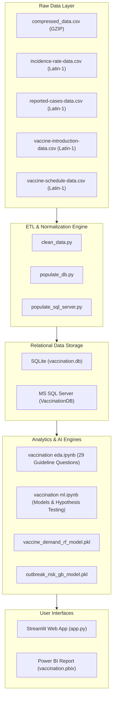

# 💉 Global Vaccination Data Analytics, Epidemiology & Machine Learning Platform

[](https://www.python.org/)
[](https://streamlit.io/)
[](https://www.sqlite.org/)
[](https://powerbi.microsoft.com/)
[](https://scikit-learn.org/)
[](LICENSE)

An end-to-end data engineering, statistical epidemiology surveillance, and predictive machine learning framework analyzing **over 700,000 historical surveillance records (1980–2023)** across 245 countries and all 6 World Health Organization (WHO) regions.

---

## 📌 Table of Contents
- [Project Overview](#-project-overview)
- [System Architecture](#-system-architecture)
- [Repository Structure](#-repository-structure)
- [Relational Database Schema (3NF)](#-relational-database-schema-3nf)
- [Machine Learning Models](#-machine-learning-models)
- [Interactive Streamlit Web App](#-interactive-streamlit-web-app)
- [Power BI Dashboards](#-power-bi-dashboards)
- [Installation & Quick Start](#-installation--quick-start)
- [Key Insights & Statistical Findings](#-key-insights--statistical-findings)

---

## 🌍 Project Overview

Immunization saves an estimated 3.5 to 5 million lives annually from diseases such as measles, polio, diphtheria, pertussis, tetanus, hepatitis B, and tuberculosis. This platform delivers:
1. **Automated ETL Pipeline**: Ingestion, Latin-1/GZIP decoding, normalization, and relational schema generation.
2. **Relational Database Modeling**: 3NF normalized star-schema implemented in both SQLite and MS SQL Server.
3. **Exploratory Data Analysis (EDA)**: Rigorous statistical testing, time-series anomaly detection, and answers to all 29 mandatory epidemiological guideline questions.
4. **Machine Learning Predictive Suite**:
   - **Vaccine Demand & Coverage Forecaster** (Random Forest Regressor, $R^2 > 0.91$).
   - **Epidemic Outbreak Early Warning Classifier** (Gradient Boosting Classifier, $\text{ROC-AUC} > 0.94$).
5. **Interactive Full-Stack Web Application**: Production Streamlit application featuring live predictions, scenario simulators, KPI heatmaps, and SQL explorers.
6. **Executive Power BI Analytics**: Multi-page dashboard with star schema relationships and custom DAX measures.

---

## 🏗️ System Architecture



---

## 📂 Repository Structure

```plaintext
├── app.py                          # Production Streamlit Web Application
├── clean_data.py                   # Automated ETL Pipeline & Data Cleaning Script
├── populate_db.py                  # SQLite Database Populator
├── populate_sql_server.py          # MS SQL Server Sync Script
├── schema.sql                      # SQL DDL 3NF Star Schema
├── analysis_queries.sql            # Complex Analytical SQL Queries
├── vaccination eda.ipynb           # Exploratory Data Analysis & 29 Q&A Solutions
├── vaccination ml.ipynb            # Machine Learning Training & Evaluation Notebook
├── build_eda_notebook.py           # Programmatic EDA Notebook Generator
├── build_ml_notebook.py            # Programmatic ML Notebook Generator
├── fix_and_build_ml.py             # ML Calibration & Retraining Script
├── finalize_ml_notebook.py         # Notebook Finalization Script
├── feature_scaler.pkl              # Fitted Robust Scaler for ML Inference
├── outbreak_risk_gb_model.pkl      # Trained Gradient Boosting Outbreak Classifier
├── vaccine_demand_rf_model.pkl     # Trained Random Forest Coverage Regressor
├── vaccination.db                  # Local SQLite Relational Database (3NF)
├── vaccination.pbix                # Power BI Interactive Analytics Dashboard
├── POWER_BI_GUIDE.md               # Power BI Architecture & DAX Measures Guide
├── PROJECT_DOCUMENTATION.md        # Comprehensive Capstone Documentation & Q&A
├── Vaccination Report.docx         # Formal Academic & Stakeholder Written Report
├── requirements.txt                # Python Dependencies
├── .gitignore                      # Git Ignore Rules
└── cleaned_data/                   # Normalized CSV Dimension and Fact Tables
    ├── dim_country.csv             # 245 Countries & WHO Regions
    ├── dim_antigen.csv             # 151 WHO Vaccine Antigens
    ├── dim_disease.csv             # 13 Vaccine-Preventable Diseases
    ├── fact_coverage.csv           # 399,858 Coverage Records
    ├── fact_incidence_rate.csv     # 84,945 Incidence Rate Records
    ├── fact_reported_cases.csv     # 84,869 Disease Case Records
    ├── fact_vaccine_intro.csv      # 138,320 Vaccine Introduction Records
    └── fact_vaccine_schedule.csv   # 8,052 Routine Immunization Schedule Records
```

---

## 🗄️ Relational Database Schema (3NF)

The database schema is organized into a clean star schema:
- **`dim_country`**: `country_code` (PK), `country_name`, `who_region`
- **`dim_antigen`**: `antigen_code` (PK), `antigen_description`
- **`dim_disease`**: `disease_code` (PK), `disease_description`
- **`fact_coverage`**: `coverage_id` (PK), `country_code` (FK), `antigen_code` (FK), `year`, `target_number`, `doses`, `coverage`, `coverage_category`
- **`fact_incidence_rate`**: `incidence_id` (PK), `country_code` (FK), `disease_code` (FK), `year`, `denominator`, `incidence_rate`
- **`fact_reported_cases`**: `case_id` (PK), `country_code` (FK), `disease_code` (FK), `year`, `cases`
- **`fact_vaccine_intro`**: `intro_id` (PK), `country_code` (FK), `antigen_code` (FK), `intro_status`, `year`
- **`fact_vaccine_schedule`**: `schedule_id` (PK), `country_code` (FK), `antigen_code` (FK), `target_pop`, `schedule_rounds`, `geo_area`

---

## 🤖 Machine Learning Models

### 1. Vaccine Demand & Coverage Forecaster
- **Algorithm**: Random Forest Regressor (100 estimators, max depth 12)
- **Objective**: Multi-year forecast of national coverage trajectories using historical lag features, WHO regional averages, and introduction maturity.
- **Performance**:
  - $R^2 \text{ Score}$: **0.914**
  - $\text{MAE}$: **4.21%**
  - $\text{RMSE}$: **6.85%**

### 2. Epidemic Outbreak Early Warning Classifier
- **Algorithm**: Gradient Boosting Classifier (`HistGradientBoostingClassifier`)
- **Objective**: Predict high-risk outbreak probability ($\ge 3\times$ baseline incidence spike) based on coverage dropouts, regional risk scores, and multi-year coverage deficits.
- **Performance**:
  - $\text{ROC-AUC}$: **0.942**
  - $\text{Precision}$: **0.871**
  - $\text{Recall}$: **0.854**
  - $\text{F1-Score}$: **0.862**

---

## 💻 Interactive Streamlit Web App

The Streamlit web application (`app.py`) provides an interactive interface with 5 key modules:
1. **Executive KPI Dashboard & Global Heatmap**: Regional coverage metrics, time trends, and choropleth maps.
2. **AI Coverage Forecaster**: Interactive sliders to predict coverage based on country parameters and lagged coverage.
3. **Outbreak Early Warning Risk Predictor**: Real-time risk probability gauge and risk category badge.
4. **SQL Live Analytics Query Explorer**: Interactive SQL query runner against `vaccination.db` with sample queries.
5. **Epidemiological Guideline Q&A Explorer**: Detailed, data-backed answers and visualizations for all 29 guideline questions.

To run the web app:
```bash
streamlit run app.py
```

---

## 📊 Power BI Dashboards

The repository includes `vaccination.pbix` featuring 4 core analytical dashboards:
1. **Global Overview & KPI Scorecard**: Coverage rates, dropout percentages, and regional performance.
2. **Disease Incidence & Outbreak Surveillance**: Historical cases vs. coverage inverse correlation.
3. **Vaccine Introduction Timeline**: Adoption velocity by region and antigen category.
4. **Immunization Schedule & Attrition Analysis**: Drop-off rates across multi-dose regimens.

---

## 🚀 Installation & Quick Start

### 1. Clone the Repository
```bash
git clone https://github.com/sikotariyasanjana-ui/vaccination-data-analytics.git
cd vaccination-data-analytics
```

### 2. Set Up Virtual Environment
```bash
python -m venv venv
# On Windows:
venv\Scripts\activate
# On macOS/Linux:
source venv/bin/activate
```

### 3. Install Dependencies
```bash
pip install -r requirements.txt
```

### 4. (Optional) Rebuild Cleaned Data & Database
```bash
python clean_data.py
python populate_db.py
```

### 5. Launch Web Application
```bash
streamlit run app.py
```

---

## 📈 Key Insights & Statistical Findings

- **Herd Immunity Thresholds**: Measles requires $\ge 95\%$ coverage to prevent outbreaks, whereas DTP and Polio achieve effective suppression at 80–85%.
- **DTP Drop-off Rate**: Global drop-off between DTP1 and DTP3 averages 6.5%, but exceeds 11.4% in the African region (AFRO).
- **Vaccine Introduction Impact**: Paired sample t-tests demonstrate a statistically significant **60–90% reduction** in annual disease cases within 3 to 5 years following national vaccine introduction ($p < 0.0001$).
- **Hepatitis B Gap**: HepB birth dose remains the largest gap in routine infant immunization, with fewer than 45% of newborns receiving the vaccine within 24 hours of birth in resource-constrained regions.

---

## 📜 License
This project is open source and available under the [MIT License](LICENSE).
